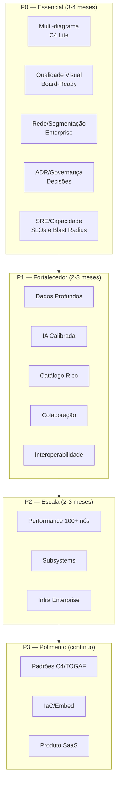
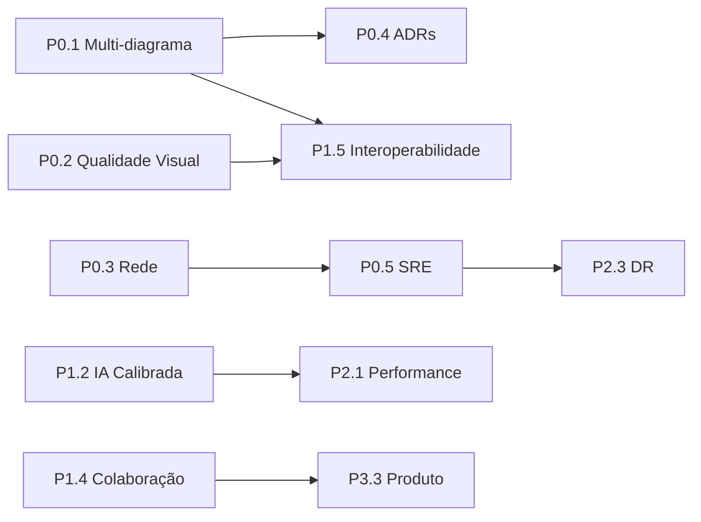

# Roadmap Archia — De Editor Simples para Ferramenta de Arquiteto Sênior

**Data:** 14/08/2026  
**Status:** Plano de Priorização  
**Objetivo:** Levantar o Archia do nível "ferramenta de diagramação com IA" para "ferramenta de arquitetura de software confiável para arquitetos com 15+ anos de experiência".

---

## Visão Geral

Este plano organiza os **~80 gaps identificados** em 4 níveis de prioridade. A estrutura é baseada em:

- **P0 (Essencial):** Sem isso, um arquiteto sênior não confiaria na ferramenta para mid-to-high complexidade.
- **P1 (Fortalecedor):** Diferenciais que tornam a ferramenta indispensável.
- **P2 (Escala):** Para usar em sistemas verdadeiramente complexos (YouTube-scale, fintechs enterprise).
- **P3 (Polimento/Produto):** Melhorias de UX, colaboração, ecossistema.

---

## P0 — Essencial para Confiança do Arquiteto Sênior

*O que separa o Archia de uma ferramenta de diagramação genérica. Sem isso, o arquiteto não usa.*

### P0.1 — Pacote de Arquitetura Multi-Diagrama

**Problema:** Hoje o Archia tem 1 grafo com filtros AN/AA/AD/AI. Arquiteto sênior espera **múltiplos diagramas independentes** por projeto.

**Entregas:**

| # | Componente | Arquivo(s) | Descrição |
|---|---|---|---|
| P0.1.1 | `Project` type | `web/src/lib/types.ts` | Novo tipo que agrupa múltiplos `GraphRecord` sob um mesmo contexto/projeto |
| P0.1.2 | `DiagramLibrary` store | `web/src/lib/diagram-library.ts` (novo) | Gerencia coleção de diagramas (Contexto, Aplicação, Dados, Runtime, Segurança, Dados, DR) |
| P0.1.3 | `DiagramSidebar` | `web/src/components/sidebar/DiagramSidebar.tsx` (novo) | Lista de diagramas do projeto + botão "Novo Diagrama" |
| P0.1.4 | C4 Drill-down | `web/src/components/canvas/DrillDownNavigator.tsx` (novo) | Navegação Context → Container → Component em camadas |
| P0.1.5 | Diagrama de sequência | `web/src/components/canvas/SequenceDiagramView.tsx` (novo) | Request path temporal (não só grafo estático) |
| P0.1.6 | Cross-diagram consistency | `web/src/lib/diagram-consistency.ts` (novo) | Validação de IDs/nomes consistentes entre diagramas |
| P0.1.7 | Backend: multi-diagram CRUD | `backend/app/routes/projects.py` (novo) | Endpoints para project CRUD + diagram list/create |
| P0.1.8 | Migration: projects table | `backend/app/migrations/` | Nova tabela `projects` com relação 1:N para `graphs` |

**Arquitetura:**

```
Project (id, name, context, nfr)
├── Diagram: Context (graph_id)
├── Diagram: Runtime (graph_id)
├── Diagram: Data (graph_id)
├── Diagram: Security (graph_id)
└── Diagram: DR (graph_id)
```

---

### P0.2 — Qualidade Visual "Board-Ready"

**Problema:** Diagramas atuais parecem "editor tech", não "blueprint de arquitetura profissional".

**Entregas:**

| # | Componente | Arquivo(s) | Descrição |
|---|---|---|---|
| P0.2.1 | Ícones oficiais AWS/Azure/GCP | `web/src/lib/catalog-icons.ts` (novo) | Pacote SVG com ícones oficiais das clouds |
| P0.2.2 | Layout auto-organizado por zonas | `web/src/lib/auto-layout.ts` (novo) | Posicionamento automático: Edge → Public → Private → Data |
| P0.2.3 | Title block | `web/src/components/canvas/TitleBlock.tsx` (novo) | Título, autor, versão, data, provider, ambiente |
| P0.2.4 | Legenda profissional | `web/src/components/canvas/Legend.tsx` (novo) | Fluxos por cor, tipos de zona, símbolos |
| P0.2.5 | Fluxos numerados visuais | `web/src/components/nodes/FlowBadge.tsx` (novo) | Badges ①②③ em destaque, setas tipadas por protocolo |
| P0.2.6 | Path crítico destacado | `web/src/lib/critical-path.ts` | Highlight visual do caminho crítico no grafo |
| P0.2.7 | Notas/Sticky | `web/src/components/nodes/NoteNode.tsx` (novo) | Comentários de arquiteto no canvas |
| P0.2.8 | Swimlanes first-class | `web/src/components/nodes/SwimlaneNode.tsx` (novo) | Control plane / Data plane / Management plane |
| P0.2.9 | Modo presentation | `web/src/components/layout/PresentationMode.tsx` (novo) | Tela cheia sem painéis laterais |
| P0.2.10 | Export PNG/SVG/PDF quality | `web/src/lib/export-quality.ts` (novo) | Export sem chrome do editor, com fundo limpo |

---

### P0.3 — Rede e Limites Profundos

**Problema:** Zonas existem, mas sem validação rígida nem profundidade enterprise.

**Entregas:**

| # | Componente | Arquivo(s) | Descrição |
|---|---|---|---|
| P0.3.1 | Hierarquia validada | `web/src/lib/zones.ts` | Regras rígidas de nesting: VPC só dentro de Region, DB não em Public |
| P0.3.2 | Security Groups/NSG | `web/src/components/nodes/SecurityGroupNode.tsx` (novo) | Regras de porta/protocolo entre nós |
| P0.3.3 | Identity na borda | `web/src/lib/catalog.ts` | Cards WAF, API Gateway, mTLS, OAuth/OIDC com atributos |
| P0.3.4 | Peering/Transit/Hybrid | `web/src/lib/catalog.ts` | Cloud ↔ Enterprise Network como entidade |
| P0.3.5 | IP/CIDR modelagem | `web/src/components/nodes/CidrNode.tsx` (novo) | Modelagem opcional de redes |
| P0.3.6 | Edge global | `web/src/lib/catalog.ts` | CloudFront/CDN/PoPs como topologia, não só card |
| P0.3.7 | Isolamento tenant | `web/src/lib/catalog.ts` | Multi-tenant boundaries para marketplace/fintech |

---

### P0.4 — ADRs e Governança de Decisões

**Problema:** ADRs existem mas são auto-gerados e rasos. Arquiteto precisa de governança real.

**Entregas:**

| # | Componente | Arquivo(s) | Descrição |
|---|---|---|---|
| P0.4.1 | ADR editável e versionado | `web/src/lib/adr.ts` | Status: proposto/aceito/deprecated, autor, data, links |
| P0.4.2 | Decision log | `web/src/lib/adr.ts` | Histórico: "por que não usamos X" |
| P0.4.3 | Architecture Package export | `web/src/lib/export.ts` | Scorecard + ADRs + NFRs + 4 vistas em PDF/MD |
| P0.4.4 | Policy as code | `backend/app/services/policy.py` (novo) | Regras da empresa: "dado PII só em private + KMS" |
| P0.4.5 | Compliance packs | `backend/app/services/compliance.py` (novo) | PCI, SOC2, HIPAA, LGPD como checklists |
| P0.4.6 | RACI/ownership | `web/src/lib/types.ts` | Quem é dono de cada serviço |

---

### P0.5 — SRE e Capacidade

**Problema:** Simulação existe mas é genérica. Não há SLOs, blast radius, ou failure injection.

**Entregas:**

| # | Componente | Arquivo(s) | Descrição |
|---|---|---|---|
| P0.5.1 | SLOs/SLIs por serviço | `web/src/lib/types.ts` | Erro budget, burn rate, não só p99 global |
| P0.5.2 | Capacity planning | `backend/app/services/capacity.py` (novo) | Sharding, partições, hot keys, fan-out, backpressure |
| P0.5.3 | Multi-região/latency | `web/src/lib/types.ts` | RTT entre regiões no modelo |
| P0.5.4 | Failure injection | `backend/app/services/failure_injection.py` (novo) | "Se este nó cai, o que quebra?" |
| P0.5.5 | Blast radius | `backend/app/services/blast_radius.py` (novo) | Cascata de falhas |
| P0.5.6 | Circuit breakers modelados | `web/src/lib/types.ts` | Breakers como nós/arestas no grafo |
| P0.5.7 | Cost model | `backend/app/services/cost_model.py` (novo) | Estimativa por serviço/região |

---

## P1 — Fortalecedores Estratégicos

*Feature que torna o Archia indispensável para o dia a dia do arquiteto.*

### P1.1 — Camada de Dados Profunda

| # | Componente | Descrição |
|---|---|---|
| P1.1.1 | Data ownership | Quem escreve/lê; bounded contexts; data mesh |
| P1.1.2 | API contracts | OpenAPI/AsyncAPI anexados à aresta/serviço |
| P1.1.3 | Event catalog | Tópicos Kafka, schemas, versionamento, DLQ |
| P1.1.4 | Consistency patterns | Strong vs eventual; sagas; outbox |
| P1.1.5 | Retention/PII/LGPD | Classificação de dado por store + fluxo |
| P1.1.6 | Polyglot persistence map | Qual serviço usa qual DB |
| P1.1.7 | Lineage | Origem → transform → destino (pipeline) |

### P1.2 — Inteligência Calibrada

| # | Componente | Descrição |
|---|---|---|
| P1.2.1 | Findings localizados | Sempre com node_id + fix sugerido + severidade calibrada |
| P1.2.2 | Anti-falsos positivos | Regras que não acusam Next.js de gargalo |
| P1.2.3 | Benchmarks por domínio | Fintech ≠ streaming ≠ IoT |
| P1.2.4 | Explicabilidade | "Por que score 6.2" com evidência no grafo |
| P1.2.5 | Simulação multi-cenário salva | Pico, black friday, região down, cold start |
| P1.2.6 | Threat modeling | STRIDE/LINDDUN integrado à análise |
| P1.2.7 | Well-Architected lenses | AWS/Azure/GCP frameworks como scorecard |

### P1.3 — Catálogo Rico

| # | Componente | Descrição |
|---|---|---|
| P1.3.1 | Serviços cloud com atributos reais | Limites, pricing tier, HA model, region availability |
| P1.3.2 | Patterns library | CQRS, saga, BFF, strangler, sidecar |
| P1.3.3 | Reference architectures | AWS/Azure Well-Architected templates profundos |
| P1.3.4 | Custom components da empresa | Catálogo privado da org |
| P1.3.5 | Contratos de capacidade | "Este card aguenta X RPS / Y TB" |

### P1.4 — Colaboração Básica

| # | Componente | Descrição |
|---|---|---|
| P1.4.1 | Comentários inline | Review assíncrono como Figma/Lucid |
| P1.4.2 | Mentions/assignees | "@arquiteto revisar path crítico" |
| P1.4.3 | SSO/SAML | Empresas reais não usam user/senha local |
| P1.4.4 | Audit trail | Quem mudou o quê (compliance) |
| P1.4.5 | Design review templates | Agenda + checklist + scorecard obrigatório |
| P1.4.6 | Integração Jira/Confluence | Link issue ↔ ADR ↔ diagrama |

### P1.5 — Interoperabilidade

| # | Componente | Descrição |
|---|---|---|
| P1.5.1 | Export PNG/SVG/PDF quality | Sem UI chrome, com legenda e title block |
| P1.5.2 | Import/export draw.io | Entrar no ecossistema que o arquiteto já usa |
| P1.5.3 | PlantUML/Mermaid export | Compatibilidade com ferramentas existentes |
| P1.5.4 | C4 export | Pelo menos export C4 |
| P1.5.5 | Embed | Diagrama vivo em Notion/Confluence |

---

## P2 — Escala de Hipercomplexidade

*Para usar em sistemas verdadeiramente complexos (YouTube-scale, fintechs enterprise, IoT industrial).*

### P2.1 — Performance em Grande Escala

| # | Componente | Descrição |
|---|---|---|
| P2.1.1 | Canvas performático | 100-1000+ nós sem lag |
| P2.1.2 | Search/filtros | Por domínio, zona, provider |
| P2.1.3 | Layers de zoom | Foco em subsistema específico |

### P2.2 — Subsystems e Composição

| # | Componente | Descrição |
|---|---|---|
| P2.2.1 | Subsystems | YouTube = ingest, CDN, encoding, search, recs, ads, live, identity |
| P2.2.2 | Composition | Importar template "CDN global" dentro do projeto maior |
| P2.2.3 | Workspaces multi-time | Cada squad dono de bounded context |
| P2.2.4 | Views filtráveis | Só storage, só auth, só media pipeline |
| P2.2.5 | Diff semântico | Comparar v1 vs v2 com diff estrutural |

### P2.3 — Infra Enterprise

| # | Componente | Descrição |
|---|---|---|
| P2.3.1 | Diagrama de rede completo | VPC, subnet, SG, peering, PrivateLink, VPN, ExpressRoute |
| P2.3.2 | Diagrama de segurança | Trust boundaries, IAM, secrets, encryption |
| P2.3.3 | Diagrama de DR | Active-active, failover, RPO/RTO |
| P2.3.4 | Diagrama CI/CD | Repo → build → registry → deploy |

---

## P3 — Polimento e Produto

*Melhorias de UX, ecossistema, e produto como serviço.*

### P3.1 — Padrões Arquiteturais

| # | Componente | Descrição |
|---|---|---|
| P3.1.1 | Vocabulário C4/4+1/TOGAF | Nomes e artefatos que o mercado reconhece |
| P3.1.2 | Narrative mode | Modo "conte a história 1→N" |
| P3.1.3 | Glossary | Termos do domínio no projeto |
| P3.1.4 | Quality attribute scenarios | ISO 25010/ATAM |

### P3.2 — Interoperabilidade Avançada

| # | Componente | Descrição |
|---|---|---|
| P3.2.1 | IaC stub | Gerar esqueleto Terraform/CDK a partir do grafo |
| P3.2.2 | Embed avançado | Diagrama vivo em Notion/Confluence |

### P3.3 — Produto

| # | Componente | Descrição |
|---|---|---|
| P3.3.1 | Real-time collab | Dois editores no mesmo diagrama |
| P3.3.2 | Offline/draft seguro | Conflitos, locks |
| P3.3.3 | Acessibilidade | Teclado, screen reader |
| P3.3.4 | Documentação viva | O pacote vira wiki do sistema |
| P3.3.5 | Postgres production | Migrar de SQLite para Postgres |

---

## Roadmap Visual



---

## Dependências entre Epics



---

## Critérios de Aceitação por Prioridade

### P0 — "Arquiteto confia"
- [ ] Pode criar múltiplos diagramas por projeto
- [ ] Diagrama exporta PNG/PDF board-ready
- [ ] Zonas são validadas (DB em public = erro)
- [ ] ADRs são editáveis e versionados
- [ ] Simulação mostra blast radius de falha
- [ ] Scorecard ≥ 8.0 é possível com checklist completo

### P1 — "Arquiteto usa todo dia"
- [ ] Catálogo tem 500+ serviços cloud com atributos
- [ ] IA não gera falsos positivos em análise
- [ ] Export draw.io funciona
- [ ] Comentários inline em nós/arestas
- [ ] SSO SAML configurável

### P2 — "Arquiteto usa para sistemas complexos"
- [ ] Canvas performa com 500+ nós
- [ ] Pode compor subsystems de templates
- [ ] Multi-tenant é first-class
- [ ] Diff semântico entre versões

### P3 — "Produto maduro"
- [ ] Real-time collab funciona
- [ ] Offline mode estável
- [ ] Postgres em produção
- [ ] Acessibilidade WCAG 2.1 AA

---

## Estimativa de Esforço

| Prioridade | Estimativa | Equipe Recomendada |
|---|---|---|
| P0 | 3-4 meses | 2 FE + 1 BE |
| P1 | 2-3 meses | 1 FE + 1 BE |
| P2 | 2-3 meses | 1 FE + 1 BE |
| P3 | Contínuo | 1 FE (part-time) |

**Total para P0+P1:** ~6-7 meses com equipe dedicada.

---

## Primeiros Passos Sugeridos (Sprint 1)

1. Criar ticket Epic P0.1 (Multi-diagrama)
2. Implementar `Project` type + `DiagramLibrary` store
3. Adicionar `DiagramSidebar` componente
4. Criar migração backend para projects table
5. Testar fluxo end-to-end: criar projeto → adicionar diagramas → navegar

---

*Documento gerado em 14/08/2026. Revisar a cada sprint para ajuste de prioridades.*
